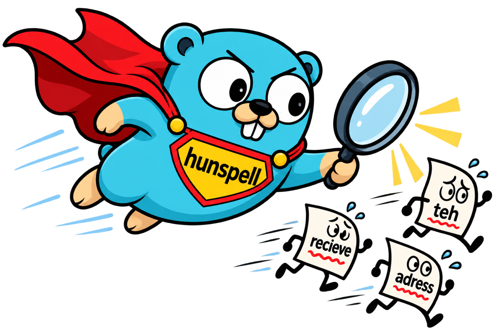

<p align="center">
  
</p>

<h1 align="center">go-hunspell</h1>

<p align="center">
  <a href="https://github.com/documatrix/go-hunspell/actions/workflows/go.yml"></a>
  <a href="https://pkg.go.dev/github.com/documatrix/go-hunspell"></a>
  
  <a href="#compatibility-testing"></a>
  <a href="https://github.com/documatrix/go-hunspell/tags"></a>
  
  
  
  <a href="LICENSE"></a>
  <a href="https://neeyo.io"></a>
</p>

`go-hunspell` is a pure Go port of [Hunspell](https://github.com/hunspell/hunspell),
the spell checker of LibreOffice, Firefox, Chrome and macOS.

It is not a re-implementation "in the spirit of" Hunspell: the engine is a
line-by-line port of the C++ code (hash manager, affix manager, compounding,
suggestion manager, morphology), so it reads every Hunspell dictionary and
gives the same answers, down to the order of the suggestions.

* **Complete:** every `.aff` option of Hunspell 1.7, all flag formats, all
  8-bit encodings, hzip (`.hz`) dictionaries, morphological analysis,
  stemming and generation, and Hunspell's suggestion algorithms (REP, MAP,
  PHONE, n-gram, compound suggestions).
* **Verified against the C++ library:** the complete upstream test suite,
  golden outputs of the C++ API and tools for every upstream test
  dictionary (including over a thousand deliberately broken affix files),
  and differential runs on 29 LibreOffice dictionaries; 100% statement
  coverage. See
  [Compatibility testing](#compatibility-testing).
* **Pure Go, no dependencies:** no cgo, builds for every `GOOS`/`GOARCH`
  Go supports (Linux, macOS, Windows, the BSDs, WebAssembly, ...).
* **A friendly Go API:** UTF-8 in and out whatever the dictionary encoding,
  loading from files, readers, byte slices or an `fs.FS` (`go:embed`), safe
  for concurrent use, text tokenizers, word-list overlays and a cache of
  loaded dictionaries for servers.
* **Fast:** on par with the C++ library — faster at checking correct words
  and suggesting, a little slower at loading and morphology (see
  [Benchmarks](#benchmarks)).

```go
d, err := gohunspell.Load("en_US") // or gohunspell.Open("en_US.aff", "en_US.dic")
if err != nil {
	log.Fatal(err)
}

d.Spell("speling")    // false
d.Suggest("speling")  // [spieling spelling spewing peeling splinting]
d.Stem("walked")      // [walk]
d.Analyze("walked")   // [" st:walk fl:D"]
```

## Install

```bash
go get github.com/documatrix/go-hunspell
```

Requires Go 1.27 or later.

Command line tools (ports of `hunspell`, `analyze` and `chmorph`):

```bash
go install github.com/documatrix/go-hunspell/cmd/...@latest
echo "speling" | hunspell -d en_US -a
```

## Usage

### Loading dictionaries

```go
// by path (name.dic.hz is found as well)
d, err := gohunspell.Open("dicts/de_DE.aff", "dicts/de_DE.dic")

// by name, searching DICPATH and the usual system folders
// (/usr/share/hunspell, ~/.local/share/hunspell, LibreOffice extensions, ...)
d, err := gohunspell.Load("de_DE")
names := gohunspell.Available() // [de_DE en_GB en_US ...]

// from any io.Reader (HTTP bodies, archives, ...)
d, err := gohunspell.OpenReader(affReader, dicReader)

// from memory or an fs.FS, e.g. with go:embed
d, err := gohunspell.OpenBytes(affData, dicData)

//go:embed dicts
var dicts embed.FS
d, err := gohunspell.OpenFS(dicts, "dicts/en_US.aff", "dicts/en_US.dic")

// encrypted hzip dictionaries
d, err := gohunspell.Open("x.aff", "x.dic", gohunspell.WithKey("secret"))

// extra dictionary files that reuse the affix rules (domain vocabularies)
err = d.AddDictionary("medical.dic")
```

### Checking and suggesting

```go
d.Spell("color")            // true or false

r := d.Check("unbelievably")
// {Correct:true Compound:false Forbidden:false Warn:false Root:believably}

d.Suggest("recieve")        // [receive relieve reverie]
```

Words are always UTF-8; a dictionary in ISO8859-x, KOI8, CP1251, TIS-620
and so on is converted for you.

Hunspell stops a suggestion search after about 250 ms, so a slow or busy
machine can return fewer suggestions. `gohunspell.WithoutTimeLimits()`
turns the limits off for results that never vary.

### Dictionary contents

```go
d.HasWord("walk")    // true: an entry of the .dic file (no affixes applied)
d.WordCount()        // 49568
for w := range d.Words() { ... }   // every entry
d.Expand("walk")     // [walk walked walking walk's walker walks walkers]  (like unmunch)
d.Diagnostics()      // load errors and warnings of the affix and dic parsers
```

### Morphology

With dictionaries that carry morphological fields (Hungarian, ...; the
examples use `testdata/hunspell/morph`):

```go
d.Analyze("drinks")                          // [" st:drink po:verb ts:present is:sg_3" ...]
d.Stem("drinks")                             // [drink]
d.Generate("drink", "ate")                   // [drank]  (inflect like the example)
d.GenerateMorph("eat", []string{"is:past_2"}) // [eaten]
d.SuffixSuggest("drink")                     // forms the suffix rules make
```

### Run-time words and personal dictionaries

```go
d.Add("Kubernetes")             // also accepts KUBERNETES
d.AddWithAffix("tweet", "beat") // tweets, tweeted, ...
d.AddWithFlags("blog", "S", "po:noun")
d.Remove("irregardless")        // forbid a dictionary word

d.LoadPersonalFile("~/.hunspell_en_US") // hunspell -p format: word, word/example, *word
```

### Checking text

`CheckText` and `Tokenize` split text with the dictionary's word characters
exactly like the `hunspell` tool, in plain text, LaTeX, HTML, XML, troff/man
or ODF markup. URLs, e-mail addresses and paths are skipped.

```go
for _, m := range d.CheckText(text, gohunspell.WithSuggestions()) {
	fmt.Printf("%d:%d %s -> %v\n", m.Line, m.Column, m.Word, m.Suggestions)
}

d.CheckText(latexSource, gohunspell.WithFormat(gohunspell.LaTeX))
```

The `parsers` package exposes the tokenizers on their own.

### Word lists (overlays)

A `Checker` puts word lists in front of a dictionary without changing it —
for per-project or per-document vocabularies that come and go:

```go
project, _ := gohunspell.NewWordListFile("project-words.txt") // word, # comment, *forbidden
c := gohunspell.NewChecker(d, project)

doc := &gohunspell.WordList{}
doc.Add("gohunspell")
c.AddWordList(doc)
c.Spell("gohunspell")    // true
c.Suggest("gohunspel")   // dictionary suggestions + close list words
c.CheckText(document)
c.RemoveWordList(doc)    // reset for the next document
```

### Caching loaded dictionaries

A server which checks texts for many users keeps its dictionaries loaded in
a `Cache`. A dictionary is identified by a key and a version of the caller
and loaded on first use; using it with a new version loads it again, so
changed dictionaries are picked up without further bookkeeping. Memory is
bounded: at most `WithMaxDictionaries` dictionaries are kept, the least
recently used one is dropped first, and each is loaded at most
`WithCopies` times. A `Dictionary` serializes its calls, so the copies are
what lets goroutines check with the same dictionary in parallel; they are
only loaded while all existing copies are busy.

```go
cache := gohunspell.NewCache(gohunspell.WithMaxDictionaries(8), gohunspell.WithCopies(4))

load := func() (aff, dic []byte, err error) { return db.DictionaryFiles(id) }

misspellings, err := cache.Check(id, updatedAt, load, text, []*gohunspell.WordList{customWords})
words := gohunspell.Words(misspellings) // distinct misspelled words
sugs, err := cache.Suggest(id, updatedAt, load, "speling", nil)

err = cache.Use(id, updatedAt, load, func(d *gohunspell.Dictionary) error {
	// any other call on the dictionary
	return nil
})
cache.Invalidate(id)
```

### Debugging a dictionary

`Trace` reports every decision behind a verdict, like `hunspell --trace`:

```go
d.Trace("unlikeliest", func(depth int, line string) {
	fmt.Println(strings.Repeat("  ", depth) + line)
})
// word "unlikeliest"
//   lookup "unlikeliest" -> miss
//   pfx flag=U strip="" add="un" cont=(none) cond="." at=aff:30 xprod=Y hdr=aff:29
//     stem "likeliest"
//     test condition cond="." on "likeliest" -> pass
//     lookup "likeliest" -> miss
//     sfx flag=T strip="" add="st" cont=(none) cond="e" at=aff:80 xprod=N hdr=aff:79
//       test xprod -> fail, this suffix class does not cross with a prefix
//     ...
```

### Concurrency

A `Dictionary` is safe for concurrent use; its calls are serialized (the
Hunspell engine keeps state while it checks a word). Open one `Dictionary`
per goroutine for parallel throughput.

## Hunspell feature support

Everything Hunspell 1.7 understands is implemented. On the `.good`/`.wrong`
word lists of the 151 upstream test dictionaries, go-hunspell decides every
word like Hunspell.

| Area | Option / feature | go-hunspell |
|---|---|:-:|
| **General** | `SET` UTF-8 | ✅ |
| | `SET` ISO8859-1…15, KOI8-R/U, CP1251, TIS-620, ISCII | ✅ |
| | `FLAG` char / `long` / `num` / `UTF-8` | ✅ |
| | `AF` / `AM` flag and morphology aliases | ✅ |
| | `COMPLEXPREFIXES` (right-to-left, two prefixes) | ✅ |
| | `LANG` (Turkish/Azeri dotted i, Hungarian, German rules) | ✅ |
| | `IGNORE` (e.g. Arabic/Hebrew diacritics) | ✅ |
| | `ICONV` / `OCONV` | ✅ |
| | `WORDCHARS`, `BREAK` | ✅ |
| | hzip `.hz` (also encrypted), byte order marks | ✅ |
| **Affixes** | `PFX` / `SFX` with conditions, cross products | ✅ |
| | two-level suffixes (continuation classes) | ✅ |
| | `CIRCUMFIX` | ✅ |
| | `NEEDAFFIX` / `PSEUDOROOT` | ✅ |
| | `FULLSTRIP` | ✅ |
| | `FORBIDDENWORD`, `KEEPCASE`, `CHECKSHARPS` | ✅ |
| | `SUBSTANDARD`, `LEMMA_PRESENT` | ✅ |
| | `ONLYINCOMPOUND` | ✅ |
| **Compounding** | `COMPOUNDFLAG`, `COMPOUNDBEGIN`/`MIDDLE`/`END` | ✅ |
| | `COMPOUNDRULE` (with `*`, `?`, parenthesized flags) | ✅ |
| | `COMPOUNDMIN`, `COMPOUNDWORDMAX`, `COMPOUNDROOT` | ✅ |
| | `COMPOUNDPERMITFLAG`, `COMPOUNDFORBIDFLAG`, `COMPOUNDMORESUFFIXES` | ✅ |
| | `CHECKCOMPOUNDDUP` / `REP` / `CASE` / `TRIPLE`, `SIMPLIFIEDTRIPLE` | ✅ |
| | `CHECKCOMPOUNDPATTERN` (with flags and replacements) | ✅ |
| | `FORCEUCASE`, `COMPOUNDSYLLABLE`, `SYLLABLENUM` | ✅ |
| | dictionary word pairs (`a lot`) | ✅ |
| **Suggestions** | Hunspell's algorithm and ranking | ✅ |
| | `TRY`, `KEY`, `REP` (anchored `^ $`), `MAP` | ✅ |
| | `PHONE` (aspell phonetic rules), `ph:` fields | ✅ |
| | `NOSUGGEST`, `NONGRAMSUGGEST`, `MAXNGRAMSUGS`, `MAXCPDSUGS` | ✅ |
| | `MAXDIFF`, `ONLYMAXDIFF`, `NOSPLITSUGS`, `SUGSWITHDOTS` | ✅ |
| | `WARN`, `FORBIDWARN` | ✅ |
| **Morphology** | analysis, stemming, generation, `al:` allomorphs | ✅ |
| **API** | add / remove / add with affix of an example word | ✅ |
| | multiple `.dic` files on one `.aff` | ✅ |
| | `--trace` decision log | ✅ |
| | text tokenizers (text, LaTeX, HTML, XML, man, ODF) | ✅ |
| **Tools** | `hunspell` (`-a -l -G -L -w -s -m -S -u -U -u2 -u3 -1 -t -H -X -n -O -p -D --trace`) | ✅ |
| | `analyze`, `chmorph` | ✅ |

## Compatibility testing

The goal is the behavior of the C++ library, not of a reading of its
documentation, so the expected results of the tests come from Hunspell
itself:

* **The upstream test suite.** `testdata/hunspell` holds the tests of the
  Hunspell repository, unchanged (the commit is in
  `testdata/hunspell/UPSTREAM_COMMIT`).
  `go test ./internal/cli -run TestUpstream` replays every test of
  `tests/Makefile.am` in-process (`.good`, `.wrong`, `.sug`, `.morph`,
  `.root`, `.trace` and the scripted `*.test` cases, including the C++ API
  regression tests); `TestUpstreamScripts` runs Hunspell's own unmodified
  `test.sh` and `*.test` scripts against the Go binaries. Only `abi-check.sh`
  (C++ shared library symbols) and `gh211.test` (the `makealias` awk script)
  are not run.
* **Golden API outputs** (`testdata/golden/api`). For every upstream test
  dictionary, the results of the C++ API — spell with its info flags and
  root, suggest, analyze, stem, suffix_suggest and generate — for the
  dictionary words, the test words, seeded mutations and edge cases (numbers,
  quotes, dots and dashes, over-long words, odd casing, invalid UTF-8, the
  spellml XML queries): over 24 000 words, all identical.
* **Broken dictionaries** (`testdata/golden/malformed`). 1 014 affix files of
  the upstream tests with a line deleted, duplicated, truncated or garbled,
  checked for the same results and the same load-time diagnostics as a C++
  build with `HUNSPELL_WARNING_ON`.
* **The command line tools** (`testdata/golden/cli`). About 190 runs of
  `hunspell`, `analyze` and `chmorph` (every mode and option, the pipe
  commands, personal dictionaries, all text formats including zipped ODF,
  8-bit input, error paths and exit codes) and the tokenizers, recorded from
  the C++ tools.
* **Real dictionaries.** The Go and C++ tools were compared on 29
  LibreOffice dictionaries (English, German, Hungarian, Polish, Russian,
  French, Arabic, Hebrew, Korean, Danish, ...) with randomly mutated words,
  both without time limits so that the results do not depend on the speed
  of the machine: spelling, suggestions, analysis and stemming, without a
  single difference. Without time limits, C++ needs more than two minutes
  for 60 of the words (two dictionary words glued together, where the
  compound suggestion search explodes — the reason Hunspell has time
  limits); with the normal limits both answer them in under 0.6 s, 55 of
  them identically, and for the other 5 C++ itself gives different answers
  from run to run, depending on where the limit cuts the search, and Go
  gives one of them.

The generators and the C++ programs behind the golden files are in
`internal/gen/golden`. The tests cover 100% of the statements of the library
(every package but the `cmd` mains and the generators): the time limits are
tested with a fake clock, and fuzz tests (`go test -fuzz FuzzDictionary
./internal/core`, `FuzzWord`) check that no affix file, dictionary or word
makes the engine panic. CI runs the tests on Linux, macOS and Windows and
builds every `GOOS`/`GOARCH` without cgo.

### Known differences

* Hunspell bounds the work spent on one word with wall-clock limits (250 ms
  per suggestion search, 100 ms per group of suggestions, 50 ms per compound
  search), so on pathological inputs (the `timelimit` test) the cut-off point
  depends on the machine's speed, as it does between two machines running
  the C++ code. `WithoutTimeLimits` turns them off.
* Small `.hz` files are read completely. The C++ code closes its input
  stream when the last block is decoded, so it cannot open a `.hz` file that
  decodes to less than 64 KB and drops the last block of larger ones.
* Words with NUL bytes: the C++ code mixes `std::string` and C string
  operations on them; Go strings simply contain the byte.
* `CheckText` on an 8-bit dictionary accepts a typographic apostrophe in
  "can’t", as the comments of the hunspell tool intend; the tool's encoding
  conversion fails on it.

## Benchmarks

en_US, the word lists of `testdata/bench` (1000 dictionary words, 1000
misspellings), one core of an Intel Xeon @ 2.10GHz, Go 1.27.1, the C++
library of the same Hunspell commit built with `g++ -O2`. Suggestions are
measured without time limits in both (`WithoutTimeLimits`, and the C++
limits raised), so both do the same work.

| | go-hunspell | Hunspell (C++) |
|---|--:|--:|
| load en_US | 16 ms | 13 ms |
| spell a correct word | 0.27 µs | 0.38 µs |
| spell a misspelled word | 4.1 µs | 3.4 µs |
| suggest | 15 ms | 16 ms |
| analyze | 1.7 µs | 1.4 µs |
| stem | 2.3 µs | 2.2 µs |

A `Dictionary` serializes its calls; with one `Dictionary` per goroutine,
spelling scales with the cores (`BenchmarkSpellParallel`: 72 ns per
correct word on 4 cores).

Run them with `go test -bench . .` (go-hunspell) and
`benchmarks/cpp/bench.cxx` (the C++ library, see the comment at its top).

## Packages

| Package | Contents |
|---|---|
| `github.com/documatrix/go-hunspell` | the API: `Dictionary`, `Checker`, `WordList`, `Cache`, text checking |
| `github.com/documatrix/go-hunspell/parsers` | the tokenizers of the hunspell tool |
| `github.com/documatrix/go-hunspell/cmd/hunspell` | the `hunspell` command line tool |
| `github.com/documatrix/go-hunspell/cmd/analyze` | morphological analysis tool |
| `github.com/documatrix/go-hunspell/cmd/chmorph` | morphological conversion tool |
| `internal/core` | the port of the Hunspell engine |
| `internal/charset` | the 8-bit encodings |
| `benchmarks/cpp` | the C++ benchmark program |

## License

go-hunspell is a derivative of Hunspell and is available, like Hunspell,
under the terms of any one of the MPL 1.1, the GPL 2.0 or later, or the LGPL
2.1 or later. See [LICENSE](LICENSE).

The artwork in `docs/gopher.png` is our own. The Go gopher character it is
based on was designed by [Renée French](https://reneefrench.blogspot.com/)
and is used under [CC BY 4.0](https://creativecommons.org/licenses/by/4.0/).
